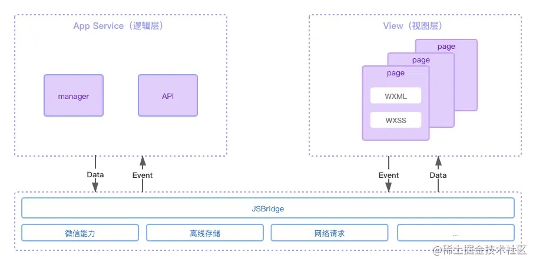

# 小程序架构

## 双线程架构

小程序为双线程架构模型，渲染层和逻辑层分别由两个线程管理。渲染层使用 webview 渲染，逻辑层采用 jsCore 运行 javascript 代码。

小程序的架构图如下：

从图中可以看出，由于逻辑层和渲染层分开，一个小程序有多个界面，所以渲染层对应存在多个 webview。这两个线程之间的通信由 native 层进行统一处理。无论是线程之间的通讯、数据的传递、网络请求都由 native 层做转发。

逻辑层、渲染层和 native 层负责的功能如下：

- 逻辑层：创建了一个单独的线程去执行 javascript，在这个环境下执行的都是小程序业务逻辑相关的代码。
- 渲染层：界面渲染相关的任务全都在 webview 线程中执行，通过逻辑层代码去控制渲染哪些页面。一个小程序存在多个界面，所以渲染层存在多个 webview 线程。
- native 层：逻辑层和渲染层之间的通信会经由微信客户端（native）做中转，逻辑层发送网络请求也经由 native 转发。

逻辑层运行在 jsCore 中，并没有一个完整浏览器对象，因为缺少相关的 dom api 和 bom api，无法操作页面元素，能达到管控的目的，但也限制了开发者的权限。

- 不允许开发者把页面跳转到其他在线页面。
- 不允许开发者直接访问 dom。
- 不允许开发者随意使用 window 上的某些未知的可能有危险的 api。

逻辑层与 ui 层完全隔离，加上以上的开发限制和小程序的审核和举报机制，使得微信可以加强对小程序的管控。

## webview 是什么？为什么要创建多个 webview？

webview 可以看作是一个嵌入式的浏览器，是嵌入在原声应用中的。webview 使用 webkit 渲染引擎来展示网页中的 view 组件，并且支持前进后退、浏览历史、放大缩小等功能。

为什么要做多个 webview？为了更加接近原生应用 app 的用户体验。

多个 webview 可以理解为多页面应用，有别于单页面应用 spa。spa 渲染页面是通过路由识别，随后动态将页面挂载到 root 节点中去，在单页面应用中打开一个新的页面，需要先卸载掉当前页面结构并重新渲染。

很显然原生 app 并不是这个样子，比较明显的特征为从页面右侧向左划入一个新的页面，并且我们可以同时看到两个页面。多页面应用就很好达到这个效果，新页面直接滑出来并且覆盖在旧页面上即可，这也是小程序现在的实现形式。这样的好处是页面切换更加流畅，用户体验更好。

## 双线程模型的优缺点

优点

- 将逻辑层和渲染层隔离开，用户无法直接操作 dom，提供了相对封闭和安全的运行环境。
- js 执行不会阻塞或干扰 webview 渲染，但是大部分情况下视图都要依赖 js 中处理的数据，js 如果被阻塞就不会通知视图去更新，这条优点意义不大。所以小程序官方提出了初始渲染缓存，缓存初始 data 的渲染结果并展示给用户。
- 所有的页面和组件的逻辑都在一个线程（app service）中运行，使用同一个上下文环境，比较好做状态共享和跨页面通讯。

缺点

- 每一次数据传递都要进行一次线程之间的通信，业务逻辑层和渲染层天然隔离，造成通信开销大、延迟高等问题，通信越频繁、数据量越大，则性能瓶颈越严重。
- 每个页面都创建一个 webview 线程处理，有更多的内存、时间开销。
- 渲染层和逻辑层状态要维护两份，进一步加重内存、时间开销，并且没有办法保证两份数据实时保持一致，例如仅使用 this.data 更新数据而不是通过 setData 时，那么实际渲染的值与逻辑层的值就不一致，某些场景下会造成非预期的问题。

从开发者的角度来看，小程序的双线程模型架构并不是一个很好的架构，逻辑层与渲染层隔离，带来的问题远远比它解决的问题更多。除了状态共享和跨页面通信外，几乎对开发者来说没啥吸引力。相对于状态共享和跨页面通信，我们当然更关心当前页面的渲染效率（性能）。

但是从微信的角度来说，他们想在享受 web 生态的好处的同时也能限制 web 的开放性，增强自己对平台内容的管控，从禁用 eval 和 new Function()就能看出一二。

当然微信也知道架构所带来的性能问题，所以发明了 wxs，让一部分 js 代码能在渲染层跑，部分解决通信消耗和延迟的问题，只能满足很小一部分场景，依旧很鸡肋。
